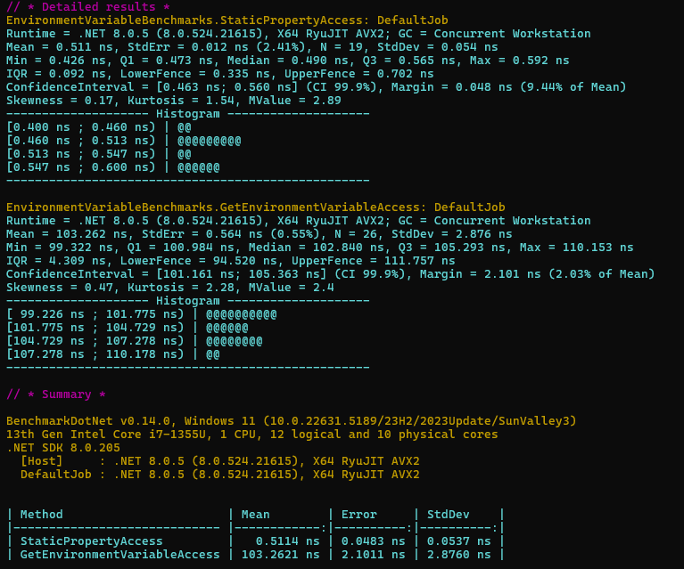

# Taviloglu.EnvGuard

**Fail-fast environment variable loader and validator for .NET applications.**  
✔️ Strongly typed  
✔️ Blazing fast  
✔️ Easy to integrate  
✔️ Developer-friendly  

[](LICENSE)

---

## 🚀 Why Taviloglu.EnvGuard?

Managing environment variables in .NET applications can get messy:
- Manual `Environment.GetEnvironmentVariable("XYZ")` calls scattered everywhere
- Repetitive null checks and conversions
- Silent runtime errors due to missing configuration

❌ It's easy to miss a critical environment variable.  
❌ It's easy to introduce bugs when refactoring or extending the app.

**Taviloglu.EnvGuard** makes environment variables **first-class citizens** in your app:
- Strongly typed
- Loaded once at startup
- Fail-fast if missing or invalid
- Easy to find, manage, and document all your configuration

✅ Focus on your application logic, not on plumbing.

---

## ✨ Key Features

- **Fail Fast**: Application crashes early if required environment variables are missing or invalid.
- **Static Strong Typing**: Access environment variables like normal properties.
- **Supports Common Types**: `string`, `int`, `long`, `bool`, `decimal`, `TimeSpan`, `Guid`.
- **Super Fast Access**: Hundreds of times faster than repeated `Environment.GetEnvironmentVariable` calls.
- **Developer Friendly**: One place to see and manage all your env vars.

---

## ⭐️ If you like it, please give a [star ⭐ on GitHub](https://github.com/staviloglu/Taviloglu.EnvGuard)!

Your support helps more people discover the project and keeps it evolving!

---

## 📦 Installation

```bash
dotnet add package Taviloglu.EnvGuard
```

---

## 🛠 Usage

### 1. Create Your Environment Variables Class

```csharp
using Taviloglu.EnvGuard.Base;
using Taviloglu.EnvGuard.Attributes;

public class MyEnvironmentVariables : EnvGuardBase
{
    [EnvGuard("DB_CONNECTION_STRING")]
    public static string DbConnectionString { get; private set; }

    [EnvGuard("ENABLE_FEATURE_X")]
    public static bool EnableFeatureX { get; private set; }

    [EnvGuard("CACHE_EXPIRATION_SECONDS", isRequired: false)]
    public static int? CacheExpirationSeconds { get; private set; }
}
```

### 2. Initialize at Startup

```csharp
MyEnvironmentVariables.Load();
```

### 3. Use Anywhere

```csharp
var connectionString = MyEnvironmentVariables.DbConnectionString;
if (MyEnvironmentVariables.EnableFeatureX)
{
    // Do something cool
}
```

---

## ⚡ Performance Benchmark

We measured access speeds using [BenchmarkDotNet](https://benchmarkdotnet.org/):

| Method | Mean Time |
|:---|:---|
| Static Property Access | **0.511 ns** |
| Environment.GetEnvironmentVariable | **103.262 ns** |

✅ Static property access is **~202x faster** than calling `Environment.GetEnvironmentVariable()` at runtime!

**Benchmark Results Screenshot:**



---

## 💬 What Developers Say

> "Finally, a simple and professional way to manage environment variables in .NET! Taviloglu.EnvGuard just makes sense."  
> — Probably you, after trying it. 😄

---

## ❤️ Support This Project

If you find Taviloglu.EnvGuard useful, consider supporting it with a **one-time sponsorship**.  
Your support will help to maintain the project, add new features, and keep it free and open source for everyone.

👉 [**Sponsor with a one-time payment →**](https://github.com/sponsors/staviloglu?frequency=one-time&sponsor=staviloglu)

Even small contributions make a huge difference!

---

## 📄 License

This project is licensed under the [MIT License](LICENSE).

---

_Developed and maintained with ❤️ by [Sinan Taviloğlu](https://github.com/staviloglu)._
